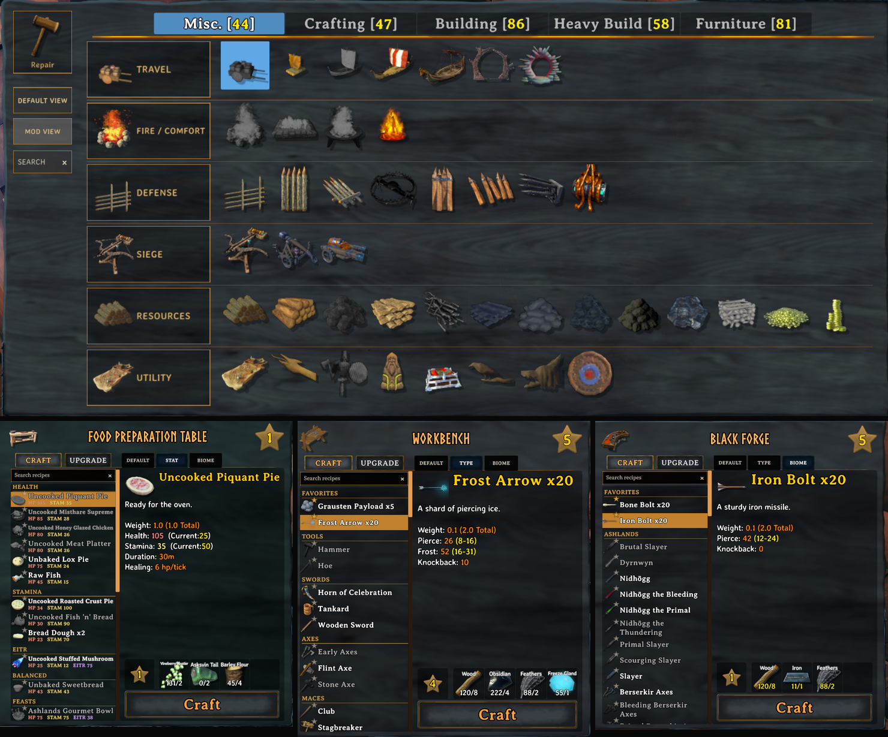

<p align="center">
  
</p>

# CraftIndex

[](https://github.com/jg224/CraftIndex/releases/latest)
[](https://github.com/jg224/CraftIndex/releases)
[](https://www.valheimgame.com/)
[](https://github.com/BepInEx/BepInEx)
[](LICENSE)
[](https://thunderstore.io/c/valheim/p/jg224/CraftIndex/)

CraftIndex is a client-side Valheim mod that turns crowded Hammer and crafting menus into readable, progression-aware interfaces. It changes presentation only: recipes, resource costs, unlocks, character progression, and world data remain untouched.



## Highlights

- Organizes every Hammer tab with inset category cards, restrained dividers, native hover feedback, and reliable mouse/controller selection.
- Adds fixed `Default View` and `Mod View` controls beneath Repair for switching between Valheim's native Hammer order and CraftIndex's organized layout.
- Adds Hammer search, a clear empty-results message, and persistent favorites that can be toggled with middle-click and remain pinned in a dedicated top section.
- Groups Crafting into Workbench, Forge, Cooking, Advanced, Processing, and Utility workflows.
- Groups Misc. into Travel, Fire / Comfort, Defense, Siege, Resources, and Utility.
- Groups Building by Wood, Core Wood, Darkwood, and Ashwood, with natural beam, floor, wall, roof, and utility ordering.
- Groups Furniture by function while sorting content by biome progression.
- Adds `Default`, `Type`/`Stat`, and `Biome` views to crafting stations.
- Adds a fixed recipe search field with one-click clearing and persistent recipe favorites.
- Widens the recipe list, wraps long names inside a fixed text area, and shows full names on hover.
- Shows readable HP, Stamina, and Eitr values for meals and feasts.
- Resolves prepared-food values from their final edible result, avoiding misleading dough or uncooked-item stats.
- Keeps every view spoiler-safe by organizing only content Valheim has already made available to the player.
- Supports modded pieces and recipes through stable fallback groups.
- Detects PlantEverything's documented custom cultivator plants and places them in an organized `Plant Everything` section without requiring PlantEverything.

## Performance

CraftIndex caches Hammer classification, category ordering, search metadata, and crafting-station recipe rows. Search filters cached content, and generated cards, dividers, labels, and headings are reused. Food-stat lookups are initialized only at food stations and cached per item. These changes reduce repeated sorting, hierarchy scans, UI allocation, and garbage collection while the menus are open.

## Install

### Thunderstore

Install [jg224-CraftIndex](https://thunderstore.io/c/valheim/p/jg224/CraftIndex/) with Thunderstore Mod Manager or r2modman. Its BepInEx dependency is installed automatically.

### Manual

1. Install BepInEx 5 for the Valheim client.
2. Download `CraftIndex-0.3.3.zip` from the [latest release](https://github.com/jg224/CraftIndex/releases/latest).
3. Remove an older `InventoryUX.dll` if one is installed.
4. Extract `CraftIndex.dll` into `Valheim/BepInEx/plugins/CraftIndex/`.
5. Start Valheim.

CraftIndex is presentation-only and does not need to be installed on a dedicated server. The original BepInEx plugin identifier is retained intentionally, so existing InventoryUX and CraftGuard settings continue to work from `BepInEx/config/com.inventoryux.valheim.cfg`. Remove an old `CraftGuard.dll` when upgrading manually; the shared identifier prevents both versions from loading together.

## Interface organization

### Hammer

| Tab | Organization |
| --- | --- |
| Misc. | Travel, Fire / Comfort, Defense, Siege, Resources, Utility |
| Crafting | Workbench, Forge, Cooking, Advanced, Processing, Utility |
| Building | Wood, Core Wood, Darkwood, Ashwood; structure-aware ordering inside each material |
| Heavy Build | Material and structure families |
| Furniture | Functional types with early-to-late biome sorting |

The fixed Repair action is excluded from dynamic sorting. Optional names beneath individual Hammer pieces can be enabled with `Hammer.ShowPieceNames`; they are off by default.

### Crafting stations

Equipment stations provide `Default`, `Type`, and `Biome` views. Food stations provide `Default`, `Stat`, and `Biome` views. Later-game biomes appear first in Biome views, while food Stat groups are ordered strongest to weakest.

Food Preparation recipes use a dedicated Feasts group and display per-serving nutrition. Mead Ketill recipes are grouped as HP, Stamina, or Utility.

## Configuration

CraftIndex generates `BepInEx/config/com.inventoryux.valheim.cfg` on first launch.

| Setting | Default | Purpose |
| --- | --- | --- |
| `General.Enabled` | `true` | Enables CraftIndex |
| `General.ShowSeparators` | `true` | Shows restrained recipe-group separators |
| `Hammer.ShowPieceNames` | `false` | Shows outlined names below Hammer pieces |
| `Hammer.FavoritePieces` | empty | Stores middle-clicked Hammer favorites; managed in-game |
| `Hammer.ToolViewModes` | Hammer: `Mod`; Hoe/Cultivator: `Default` | Remembers Default or Mod View independently for each build tool |
| `Hammer.OrganizeCrafting` | `true` | Organizes crafting stations and extensions |
| `Hammer.OrganizeBuilding` | `true` | Organizes building pieces |
| `Hammer.OrganizeHeavyBuilding` | `true` | Organizes heavy building pieces |
| `Hammer.OrganizeFurniture` | `true` | Organizes furniture pieces |
| `CraftingUI.OrganizeRecipes` | `true` | Enables station views and search |
| `CraftingUI.FavoriteRecipes` | empty | Stores recipes toggled with the row star; managed in-game |
| `Diagnostics.WriteDataInventoryOnStartup` | `false` | Writes a one-time loaded-content CSV |

The diagnostic CSV is written to `BepInEx/config/CraftIndex/loaded-data-inventory.csv`. It may contain names for all loaded content, so it is disabled by default and is never rendered in the UI.

## Compatibility and safety

- Client-side only.
- Does not modify recipes, costs, crafting rules, saves, worlds, or network state.
- Uses Valheim's already-unlocked Hammer list and already-available recipe list.
- Unknown modded content remains accessible in fallback groups.
- Personal inventory crafting stays vanilla.

PlantEverything compatibility is optional and automatic: its documented custom plants appear in their own Hammer section when both mods are installed. If another mod completely replaces the Hammer or crafting-station interface, visual conflicts are possible. Please include the BepInEx log and a screenshot in a [bug report](https://github.com/jg224/CraftIndex/issues/new?template=bug_report.yml).

## Build and test

CraftIndex targets .NET Framework 4.7.2 and references assemblies from a local Valheim/BepInEx installation. The default research path is `C:\ValheimServer\server`; override it for another installation:

```powershell
dotnet build CraftIndex.sln -c Release -p:ValheimRoot="C:\path\to\Valheim"
dotnet run --project tests/InventoryUX.CoreTests/InventoryUX.CoreTests.csproj -c Release --no-build
dotnet run --project tests/InventoryUX.ApiTests/InventoryUX.ApiTests.csproj -c Release --no-build
```

The core suite checks sorting, grouping, search, food resolution, and layout planning. The API suite checks the compiled mod against the current Valheim assemblies.

## Support and contributions

- [Report a bug](https://github.com/jg224/CraftIndex/issues/new?template=bug_report.yml)
- [Request a feature](https://github.com/jg224/CraftIndex/issues/new?template=feature_request.yml)
- Read [CONTRIBUTING.md](CONTRIBUTING.md) before submitting a pull request.

## License

CraftIndex is available under the [MIT License](LICENSE).
